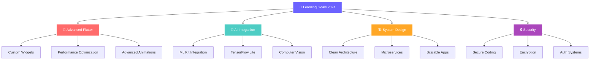

<!-- Ultra Modern Animated Banner with Particles -->
<div align="center">
  
</div>

<!-- Dynamic Typing Animation with Gradient Text -->
<div align="center">
  
</div>

<!-- Animated Profile Stats Bar -->
<div align="center">
  
  
  
</div>

<br>

<!-- Glowing Separator -->
<div align="center">
  
</div>

## 🎭 About Me - The Developer Behind the Code

<div>
  
  
  <div style="padding-right: 450px;">
    
```javascript
const shailaSithara = {
    name: "Shaila Sithara 👑",
    pronouns: "She/Her",
    location: "Kerala, India 🇮🇳",
    role: "Flutter Developer & Mobile App Architect",
    company: "Freelance",
    education: "Computer Science Enthusiast",
    
    currentlyWorking: [
        "🔥 Advanced Flutter Applications",
        "🤖 AI-Powered Mobile Solutions", 
        "🎨 Creative UI/UX Implementations"
    ],
    
    languages: {
        expert: ["Dart", "Flutter"],
        proficient: ["Python", "Java", "JavaScript"],
        learning: ["Kotlin", "Swift", "Rust"]
    },
    
    architecture: ["MVVM", "Clean Architecture", "BLoC Pattern"],
    databases: ["SQLite", "Firebase", "Hive", "MySQL"],
    tools: ["VS Code", "Android Studio", "Figma", "Git"],
    
    personalityTraits: [
        "🎯 Problem Solver",
        "📚 Continuous Learner", 
        "🌟 Innovation Enthusiast",
        "🤝 Team Collaborator"
    ],
    
    funFact: "I debug with coffee and solve problems with music! ☕🎵"
};
```

  </div>
</div>

<br clear="right"/>

### 🌈 What Drives Me
> *"Creating digital experiences that make people's lives easier and more beautiful - that's my passion!"*

🚀 **Mission:** Building intuitive mobile applications that solve real-world problems  
💡 **Vision:** Bridging the gap between complex technology and simple user experiences  
⭐ **Values:** Clean code, beautiful design, and meaningful impact  


## 🛠️ Tech Arsenal & Superpowers

<div align="center">

### 💫 Core Technologies


### 🎨 Design & Frontend


### 🗄️ Backend & Databases


### ⚡ Tools & Platforms


</div>

<!-- Animated Tech Badges -->
<div align="center">
  
  
  
  
</div>

### 🎯 Specializations & Interests
<div align="center">

| 🚀 **Mobile Development** | 🤖 **AI & ML** | 🔐 **Security** | 🎨 **Design** |
|:---:|:---:|:---:|:---:|
| Flutter Applications | Machine Learning Integration | Cybersecurity Concepts | UI/UX Design |
| Cross-Platform Solutions | AI-Powered Features | Cryptography Basics | Material Design |
| Performance Optimization | Data Science | Secure Coding | Animation & Micro-interactions |

</div>


## 🌟 Featured Projects Portfolio

<div align="center">

### 🏆 Project Showcase

<table>
<tr>
<td width="50%">

<div align="center">
<h3>📱 TasteScape - Recipe Master</h3>

</div>

**🎯 The Ultimate Cooking Companion**

A sophisticated Flutter application that revolutionizes meal planning and recipe management with stunning UI and powerful features.

```yaml
🌟 Key Features:
  ✨ Beautiful Material Design 3 UI
  🍽️ Smart Meal Planning System
  📚 Advanced Recipe Categorization
  🛒 Intelligent Shopping Lists
  🔍 AI-Powered Search & Filters
  💾 Offline-First Architecture
  📱 Responsive Cross-Platform Design
```

**Tech Stack:**
<br>


<div align="center">
<a href="https://github.com/ShailaSithara/TasteScape">
  
</a>
</div>

</td>
<td width="50%">

<div align="center">
<h3>🎓 StudentHub - Smart Records</h3>

</div>

**🎯 Modern Student Management System**

Comprehensive CRUD application with intuitive design, robust data handling, and seamless user experience for educational institutions.

```yaml
🌟 Key Features:
  👤 Complete Student Profiles
  📸 Image Upload & Management
  🔍 Real-time Search Engine
  ✅ Advanced Form Validation
  📊 Analytics Dashboard
  🎨 Modern Material UI
  📱 Tablet & Mobile Optimized
```

**Tech Stack:**
<br>


<div align="center">
<a href="https://github.com/ShailaSithara/StudentRecordApp">
  
</a>
</div>

</td>
</tr>
</table>

</div>

<div align="center">

</div>


## 🏆 Achievements & Recognition

<div align="center">

<table>
<tr>
<td align="center">

<br><b>Python Web Developer</b>
<br><i>L&T EduTech & ASAP Kerala</i>
<br><small>2024</small>
</td>
<td align="center">

<br><b>Research Paper</b>
<br><i>IRJMETS Journal</i>
<br><small>2024</small>
</td>
<td align="center">

<br><b>Mobile Development</b>
<br><i>Brototype Program</i>
<br><small>2024</small>
</td>
<td align="center">

<br><b>Flutter Expert</b>
<br><i>Self-Taught Mastery</i>
<br><small>2024</small>
</td>
</tr>
</table>

</div>


## 📊 GitHub Analytics & Performance

<div align="center">

### 🔥 GitHub Stats Overview


### 📈 Contribution Activity Graph


<div>


</div>

</div>


## 🌱 Learning & Growth Journey

<div align="center">

### 🎯 Current Focus Areas (2024)



</div>

### 📚 Reading List & Resources

<div align="center">

| 📖 **Currently Reading** | 💻 **Tech Learning** | 🎨 **Design Study** |
|:---:|:---:|:---:|
| 🧠 "Atomic Habits" - James Clear | 🔥 Flutter Advanced Patterns | 🎨 Material Design Guidelines |
| 💻 "Clean Code" - Robert Martin | 🤖 AI in Mobile Development | ✨ Motion Design Principles |
| 🏗️ "System Design Interview" | 🔐 Mobile Security Best Practices | 🎯 UX Psychology |

</div>

### 🚀 2024 Goals & Milestones

<div align="center">

**🎯 Professional Goals**
- [x] ✅ Master Flutter Advanced Concepts
- [x] ✅ Publish 2 Production Apps
- [ ] 🔄 Contribute to 5 Open Source Projects  
- [ ] 📝 Write 12 Technical Blog Posts
- [ ] 🎤 Speak at 2 Tech Conferences
- [ ] 🤖 Build AI-Powered Mobile App

**📈 Skill Development**
- [ ] 🎯 Master State Management (BLoC, Riverpod)
- [ ] 🏗️ Learn System Design Patterns
- [ ] 🔐 Cybersecurity Certification
- [ ] 🤖 Machine Learning Specialization

</div>


## 🤝 Let's Connect & Collaborate!

<div align="center">

### 💌 Reach Out & Let's Build Something Amazing Together!

<a href="https://www.linkedin.com/in/shaila-sithara">
  
</a>
<a href="mailto:shailasithara@gmail.com">
  
</a>
<a href="https://twitter.com/ShailaSithara">
  
</a>
<a href="https://dev.to/shailasithara">
  
</a>
<a href="https://medium.com/@shailasithara">
  
</a>

### 🌟 I'm Available For:

<table align="center">
<tr>
<td align="center">💼<br><b>Freelance Projects</b><br><i>Flutter App Development</i></td>
<td align="center">🤝<br><b>Open Source</b><br><i>Community Contributions</i></td>
<td align="center">💡<br><b>Collaborations</b><br><i>Innovative Ideas</i></td>
<td align="center">📚<br><b>Mentoring</b><br><i>Knowledge Sharing</i></td>
</tr>
</table>

### 📧 Quick Contact
```
📱 Mobile Development  |  🤖 AI Integration  |  🎨 UI/UX Design  |  📚 Tech Mentoring
```

</div>


<!-- Snake Animation -->
<div align="center">
  <h3>🐍 Contribution Snake Game</h3>
  
</div>


<!-- Enhanced Footer -->
<div align="center">

### ✨ Daily Inspiration

*"The future belongs to those who believe in the beauty of their dreams."* - Eleanor Roosevelt

### 🌟 Fun Facts About Me

```
☕ Coffee Enthusiast  |  🎵 Music Lover  |  📚 Bookworm  |  🌍 Travel Dreamer
🌙 Night Owl Coder   |  🎨 Design Perfectionist  |  🧩 Problem Solver  |  💫 Dreamer & Doer
```


---


**⭐ If you find my work interesting, don't forget to star my repositories! ⭐**

</div>
