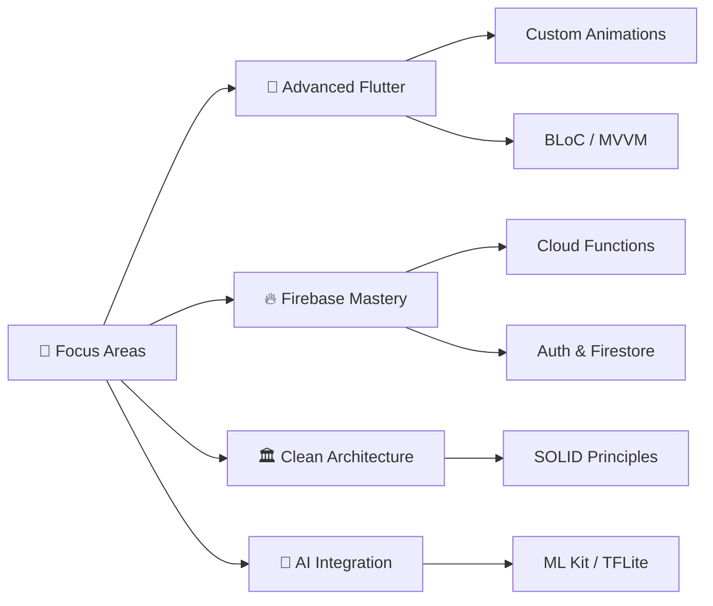

<!-- Animated Banner -->
<p align="center">
  
</p>

<!-- Typing Animation -->
<p align="center">
  
</p>

<!-- Badges -->
<p align="center">
  
  
  
</p>

---

## 🌸 About Me


```dart
class ShailaSitharaTT extends FlutterDeveloper {

  final String name      = "Shaila Sithara TT";
  final String role      = "Flutter Developer";
  final String location  = "Kerala, India 🌴";

  final List<String> stack = [
    "Flutter", "Dart", "Firebase",
    "Hive", "SQLite", "REST APIs"
  ];

  final List<String> exploring = [
    "Artificial Intelligence",
    "Clean Architecture",
    "Data Structures & Algorithms"
  ];

  String get motto =>
    "Beautiful UIs. Real-world impact. 🚀";
}
```

<br/>

🌟 **Passionate Flutter developer** building beautiful, responsive mobile apps
🔥 **Firebase & Hive** for powerful, offline-ready backends
🤖 **Exploring AI/ML** to make apps smarter
🎯 **Goal:** Expert Mobile Engineer + AI-powered App Developer
📚 **Mindset:** Continuous learner, constant builder

---

## 🛠️ Tech Arsenal

<h3 align="center">⚡ Mobile & Languages</h3>
<p align="center">
  
</p>

<h3 align="center">🗄️ Databases & Backend</h3>
<p align="center">
  
  &nbsp;
  
  
</p>

<h3 align="center">🧰 Tools & Platforms</h3>
<p align="center">
  
</p>

<p align="center">
  
  
  
  
  
</p>

---

## 🚀 Featured Projects

<div align="center">

### 📚 LingoBreeze — Language Learning App
*Learn languages beautifully. Built with Flutter & Dart.*

[](https://github.com/ShailaSithara)
[](https://github.com/ShailaSithara)

```
✨ Features:
• 🗣️ Interactive language lessons & quizzes
• 📊 Progress tracking & streaks
• 🎨 Clean, engaging UI/UX
• 📶 Offline-first architecture
```

---

### 📄 ResumeFY — Resume Builder App
*Create professional resumes in minutes.*

[](https://github.com/ShailaSithara)
[](https://github.com/ShailaSithara)

```
✨ Features:
• 🖊️ Modern resume templates
• 💾 Cloud save with Firebase
• 📤 Export-ready PDF output
• ✅ Live preview while editing
```

---

### 💬 ChatApp — Real-Time Messaging
*Fast. Clean. Real-time. Built on Firebase.*

[](https://github.com/ShailaSithara)
[](https://github.com/ShailaSithara)

```
✨ Features:
• ⚡ Real-time messaging via Firestore
• 🔐 Secure Firebase Authentication
• 📱 Smooth & responsive UI
• 🟢 Online/offline status
```

---

### 🍲 TasteScape — Recipe Discovery App
*Discover, save, and cook amazing recipes.*

[](https://github.com/ShailaSithara)
[](https://github.com/ShailaSithara)

```
✨ Features:
• 🔍 Smart recipe search & filters
• 📌 Bookmark & categorize favorites
• 📶 Offline access with Hive DB
• 🎨 Mouth-watering UI design
```

</div>

> 🔗 *More projects:* [**👥 SocialFeed**](https://github.com/ShailaSithara) · [**🏥 HospitalManagement**](https://github.com/ShailaSithara) · [**🛒 EcommerceApp**](https://github.com/ShailaSithara) · [**🏠 ToHomeStep**](https://github.com/ShailaSithara)

---

## 🏆 Achievements & Milestones

<div align="center">

| 🎯 Achievement | 📅 Year | 🏢 Organization |
|:---|:---:|:---|
| 📜 **Python Web Developer Certificate** | 2024 | L&T EduTech & ASAP Kerala |
| 📱 **Mobile App Development Training** | 2024 | Brototype |
| 📝 **Research Paper Published** | 2024 | IRJMETS Journal |
| 🦋 **8+ Flutter Projects Shipped** | 2024–25 | Self-Built Portfolio |

</div>

---

## 📊 GitHub Analytics

<div align="center">


</div>

---

## 🌱 Learning Journey

<div align="center">


```mermaid
graph LR
    A[🎯 Focus Areas] --> B[📱 Advanced Flutter]
    A --> C[🔥 Firebase Mastery]
    A --> D[🏛️ Clean Architecture]
    A --> E[🤖 AI Integration]

    B --> F[Custom Animations]
    B --> G[BLoC / MVVM]
    C --> H[Cloud Functions]
    C --> I[Auth & Firestore]
    D --> J[SOLID Principles]
    E --> K[ML Kit / TFLite]
```

</div>

---

## 🗓️ 2026 Roadmap

- [ ] 🚀 Publish Flutter apps on **Google Play Store**
- [ ] 🤖 Ship an **AI-powered mobile app**
- [ ] 🏛️ Master **Clean Architecture** end-to-end
- [ ] 🌍 Make first **open-source contribution**
- [ ] ✍️ Start writing **technical blog posts**
- [ ] 💼 Build a portfolio that speaks for itself

---

## 🤝 Let's Connect

<div align="center">

<a href="http://www.linkedin.com/in/shaila-sithara-tt">
  
</a>
&nbsp;
<a href="https://www.facebook.com/sithara.thottithodi">
  
</a>
&nbsp;
<a href="https://instagram.com">
  
</a>

<br/><br/>

```
💼 Flutter Projects  ·  🤝 Collaborations  ·  💡 Ideas  ·  📚 Knowledge Sharing
```

</div>

---

<!-- Snake Animation -->
<div align="center">
  <h3>🐍 My Contribution Snake</h3>
  
</div>

---

<div align="center">

### 💭 My Motto

*"Turning ideas into beautiful mobile experiences — one widget at a time."*

<br/>

⭐ **Thanks for visiting! Let's build something amazing together 🚀**

<br/>


**✨ Made with 💜 by Shaila Sithara TT | Updated: 2025**

</div>
