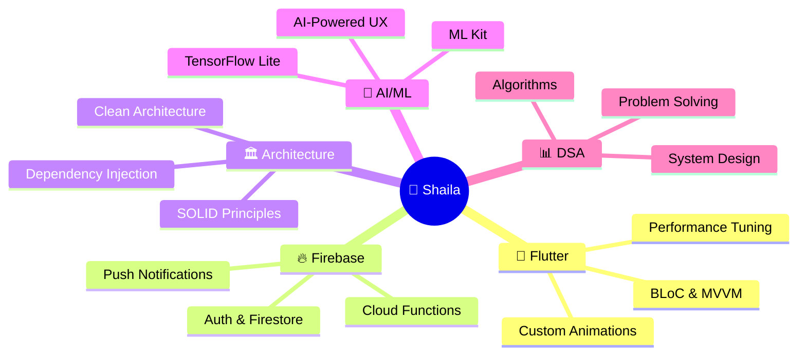

<div align="center">

<!-- Animated Header Banner -->


<!-- Animated Divider -->


<!-- Glowing Name Animation -->


<br/>

<!-- Animated Badges Row -->

&nbsp;

&nbsp;


<br/><br/>

<!-- Animated Divider -->


</div>

<br/>

##  About Me


```dart
╔══════════════════════════════════════════════╗
║         class ShailaSitharaTT               ║
║              extends Developer {            ║
╠══════════════════════════════════════════════╣
║                                              ║
║  name      : "Shaila Sithara TT"            ║
║  role      : "Flutter Developer 🦋"         ║
║  location  : "Kerala, India 🌴"             ║
║                                              ║
║  stack     : [ Flutter, Dart, Firebase,      ║
║                Hive, SQLite, REST APIs ]     ║
║                                              ║
║  exploring : [ AI/ML, Clean Architecture,   ║
║                DSA, Cloud Functions ]       ║
║                                              ║
║  String get motto =>                         ║
║    "Beautiful UIs. Real impact. 🚀"         ║
║                                              ║
╚══════════════════════════════════════════════╝
```

<br/>

- 🌟 **Passionate** about crafting beautiful, pixel-perfect mobile apps
- 🔥 **Firebase & Hive** — building offline-ready, real-time backends
- 🤖 **Exploring AI/ML** to infuse intelligence into mobile experiences
- 🎯 **Mission:** Become an expert Mobile Engineer + AI App Developer
- 💡 **Philosophy:** Ship. Learn. Iterate. Repeat.

<br/>

<div align="center">

</div>

---

##  Tech Arsenal

<div align="center">

### ⚡ Mobile & Languages


### 🗄️ Databases & Backend

&nbsp;&nbsp;


### 🧰 Tools & Platforms


<br/>

<!-- Animated Tech Badges -->


</div>

<div align="center">

</div>

---

##  Featured Projects

<div align="center">

<table>
<tr>
<td width="50%" valign="top">

### 📚 LingoBreeze
> *Language learning, beautifully reimagined*


```
🗣️  Interactive lessons & quizzes
📊  Progress tracking & streaks
🎨  Engaging, clean UI/UX
📶  Offline-first with Hive DB
```

[](https://github.com/ShailaSithara/LingoBreeze)

</td>
<td width="50%" valign="top">

### 📄 ResumeFY
> *Professional resumes in minutes*


```
🖊️  Modern, customizable templates
💾  Cloud save with Firebase
📤  Export-ready PDF generation
✅  Live preview while editing
```

[](https://github.com/ShailaSithara/ResumeFY)

</td>
</tr>
<tr>
<td width="50%" valign="top">

### 💬 ChatApp
> *Real-time messaging, zero lag*


```
⚡  Real-time via Cloud Firestore
🔐  Secure Firebase Auth
📱  Smooth, responsive UI
🟢  Live online/offline status
```

[](https://github.com/ShailaSithara/ChatApp)

</td>
<td width="50%" valign="top">

### 🍲 TasteScape
> *Discover, save & cook — beautifully*


```
🔍  Smart recipe search & filters
📌  Bookmark & categorize recipes
📶  Full offline support
🎨  Mouth-watering visual design
```

[](https://github.com/ShailaSithara/TasteScape)

</td>
</tr>
<tr>
<td width="50%" valign="top">

### 👥 SocialFeed
> *Social connections, Flutter-powered*


```
📰  Dynamic social feed UI
❤️  Like, comment & share
👤  User profiles & follow system
🔔  Real-time notifications
```

[](https://github.com/ShailaSithara/SocialFeed)

</td>
<td width="50%" valign="top">

### 🏥 HospitalManagement
> *Healthcare ops, streamlined*


```
🏥  Patient record management
📅  Appointment scheduling
👨‍⚕️  Doctor & staff management
📊  Dashboard & reports
```

[](https://github.com/ShailaSithara/HospitalManagement)

</td>
</tr>
</table>

> 🔗 Also check out: [**🛒 EcommerceApp**](https://github.com/ShailaSithara) · [**🏠 ToHomeStep**](https://github.com/ShailaSithara)

</div>

<div align="center">

</div>

---

## 🏆 Achievements & Milestones

<div align="center">


| ✦ | 🎯 Achievement | 📅 | 🏢 Organization |
|:---:|:---|:---:|:---|
| 🥇 | **Python Web Developer Certificate** | 2024 | L&T EduTech & ASAP Kerala |
| 🥇 | **Mobile App Development Training** | 2024 | Brototype |
| 🥇 | **Research Paper Published** | 2024 | IRJMETS Journal |
| 🥇 | **8+ Flutter Projects Shipped** | 2024–25 | Self-Built Portfolio |

</div>

<div align="center">

</div>

---

## 📊 GitHub Analytics

<div align="center">


<br/><br/>


<br/>


</div>

<div align="center">

</div>

---

## 🌱 Learning Journey

<div align="center">


```mermaid
mindmap
  root((🎯 Shaila))
    📱 Flutter
      Custom Animations
      BLoC & MVVM
      Performance Tuning
    🔥 Firebase
      Auth & Firestore
      Cloud Functions
      Push Notifications
    🏛️ Architecture
      Clean Architecture
      SOLID Principles
      Dependency Injection
    🤖 AI/ML
      ML Kit
      TensorFlow Lite
      AI-Powered UX
    📊 DSA
      Problem Solving
      Algorithms
      System Design
```

</div>

---

## 🗓️ 2026 Roadmap

<div align="center">

| Status | Goal |
|:---:|:---|
| 🔲 | 🚀 Publish Flutter apps on **Google Play Store** |
| 🔲 | 🤖 Ship an **AI-powered mobile application** |
| 🔲 | 🏛️ Master **Clean Architecture** end-to-end |
| 🔲 | 🌍 Make meaningful **open-source contributions** |
| 🔲 | ✍️ Launch a **technical blog** |
| 🔲 | 💼 Build a portfolio that speaks for itself |

</div>

<div align="center">

</div>

---

## 🐍 Contribution Snake

<div align="center">
  
</div>

<div align="center">

</div>

---

## 🤝 Let's Connect

<div align="center">


*I love connecting with fellow developers and creators!*

<br/>

<a href="http://www.linkedin.com/in/shaila-sithara-tt">
  
</a>
&nbsp;
<a href="https://www.facebook.com/sithara.thottithodi">
  
</a>
&nbsp;
<a href="https://instagram.com">
  
</a>

<br/><br/>

```
💼 Flutter Projects  ✦  🤝 Collaborations  ✦  💡 Innovative Ideas  ✦  📚 Knowledge Sharing
```

</div>

---

<div align="center">


<br/><br/>

### 💜 My Motto


<br/>

⭐ **Thanks for visiting — let's build something amazing together!** 🚀

<br/>


</div>
