<!-- Futuristic Animated Banner -->
<p align="center">
  
</p>

<!-- Enhanced Typing Animation -->
<p align="center">
  <a href="https://git.io/typing-svg">
    
  </a>
</p>

<!-- Profile Views Counter with Animation -->
<p align="center">
  
  
</p>

---

## 🎯 About Me


```typescript
const shaila = {
    name: "Shaila Sithara",
    role: "Flutter Developer",
    location: "Kerala, India",
    languages: ["Dart", "Python", "Java"],
    frameworks: ["Flutter", "Django"],
    currentFocus: "Mobile App Development & AI",
    hobbies: ["Coding", "Reading", "Learning New Tech"],
    motto: "Code. Learn. Build. Repeat. 🚀"
};
```

🌟 **Passionate about creating beautiful, functional mobile applications**  
💡 **Always exploring new technologies and methodologies**  
🎯 **Currently mastering Flutter, Dart, Python, and AI concepts**  
📚 **Continuous learner with a growth mindset**

---

## 🛠️ Tech Arsenal

<h3 align="center">⚡ Languages & Frameworks</h3>
<p align="center">
  
</p>

<h3 align="center">🗄️ Databases & Tools</h3>
<p align="center">
  
</p>

<!-- Animated Tech Stack Badges -->
<p align="center">
  
  
  
  
</p>

### 🔍 Other Interests
```
🔐 Cybersecurity  |  🔒 Cryptography  |  🤖 Artificial Intelligence  |  📊 Data Science
```

---

## 🌟 Featured Projects

<div align="center">

### 📖 TasteScape - Recipe Manager App
*A beautifully designed Flutter app that makes cooking fun & organized*

[](https://github.com/ShailaSithara/TasteScape)
[](https://github.com/ShailaSithara/TasteScape)
[](https://github.com/ShailaSithara/TasteScape)

```
✨ Features:
• 🍽️ Smart meal planning & shopping lists
• 📚 Recipe bookmarking with categories  
• 🔍 Advanced search & filters
• 💾 Offline-first with SQLite storage
• 🎨 Beautiful, intuitive UI/UX
```

<a href="https://github.com/ShailaSithara/TasteScape">
  
</a>

---

### 🗂️ Student Record Management System
*Comprehensive CRUD application with modern UI and robust data handling*

[](https://github.com/ShailaSithara/StudentRecordApp)
[](https://github.com/ShailaSithara/StudentRecordApp)

```
✨ Features:
• 👤 Complete student profile management
• 📸 Profile picture upload & storage
• 🔍 Real-time search functionality
• ✅ Input validation & error handling
• 📱 Responsive design for all screens
```

<a href="https://github.com/ShailaSithara/StudentRecordApp">
  
</a>

</div>

---

## 🏆 Achievements & Milestones

<div align="center">

| 🎯 Achievement | 📅 Year | 🏢 Organization |
|:---|:---:|:---|
| 📜 **Python Web Developer Certificate** | 2024 | L&T EduTech & ASAP Kerala |
| 📝 **Published Research Paper** | 2024 | IRJMETS Journal |
| 🚀 **Mobile App Development** | 2024 | Brototype |
| 🎓 **Flutter Specialist** | 2024 | Self-Taught |

</div>

---

## 📊 GitHub Analytics

<div align="center">
  
### 📈 Performance Overview
  


### 🔥 Contribution Activity


### 📊 Most Used Languages


</div>

---

## 🌱 Current Learning Journey

```mermaid
graph LR
    A[🎯 Current Focus] --> B[📱 Advanced Flutter]
    A --> C[🤖 AI Integration]
    A --> D[🏗️ Clean Architecture]
    A --> E[📊 Data Structures]
    
    B --> F[State Management]
    B --> G[Custom Animations]
    C --> H[ML Kit]
    C --> I[TensorFlow Lite]
    D --> J[MVVM Pattern]
    D --> K[Dependency Injection]
```

<div align="center">



</div>

### 📚 Currently Reading
- 📖 **"Atomic Habits"** by James Clear
- 💻 **"Clean Code"** by Robert C. Martin
- 🧠 **"The Pragmatic Programmer"** by David Thomas

### 🎯 2024 Goals
- [ ] 🚀 Launch 3 Flutter apps on Play Store
- [ ] 📝 Write 12 technical blog posts
- [ ] 🤝 Contribute to 5 open-source projects
- [ ] 🎓 Complete advanced Flutter course
- [ ] 🤖 Build an AI-powered mobile app

---

## 🤝 Let's Connect & Collaborate!

<div align="center">

### 💬 Reach Out To Me

<a href="https://www.linkedin.com/in/your-link">
  
</a>
<a href="mailto:yourmail@gmail.com">
  
</a>
<a href="https://twitter.com/your-handle">
  
</a>
<a href="https://dev.to/your-username">
  
</a>

### 📧 Open for:
```
💼 Flutter Development Projects  |  🤝 Open Source Collaborations  |  💡 Innovative Ideas  |  📚 Knowledge Sharing
```

</div>

---

<!-- Snake Animation -->
<div align="center">
  <h3>🐍 Contribution Snake</h3>
  
</div>

---

<!-- Enhanced Footer -->
<div align="center">
  
### 💭 Quote of the Day
  
*"The only way to do great work is to love what you do."* - Steve Jobs


---

**✨ Made with ❤️ by Shaila Sithara | Last Updated: 2024**

</div>
